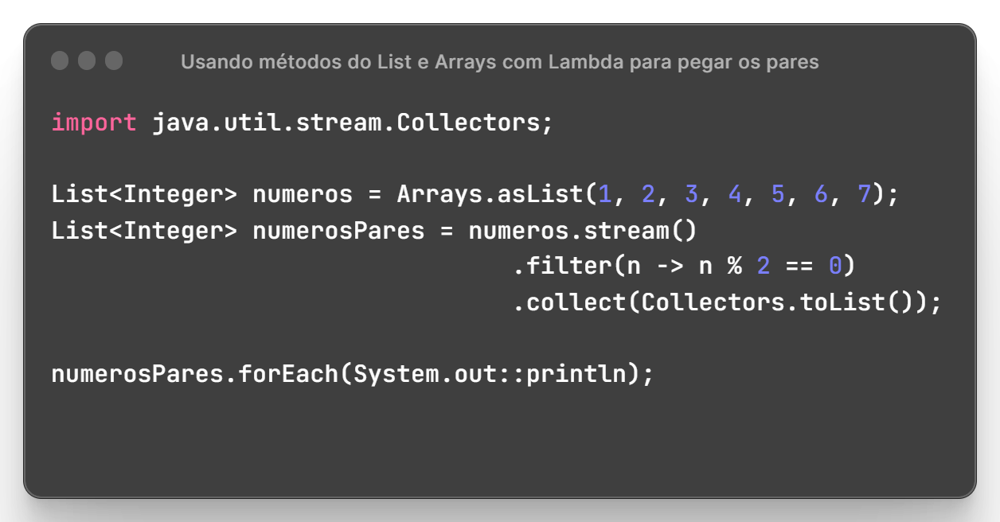

# $$\boxed{\color{orange}\Lambda \frak{ \space \color{magenta}Lambda \space \color{lightgreen}Expressions}}$$

As expressões lambda são uma forma concisa de escrever funções anônimas. 
Elas são usadas principalmente em contextos onde você precisa passar uma função como argumento para um método ou definir um comportamento personalizado para uma interface funcional.
  
A sintaxe básica de uma expressão lambda é `(argumentos) -> {corpo}`. 
Os argumentos são opcionais se a função não recebe nenhum parâmetro e o corpo pode ser uma única expressão ou um bloco de código.
  
As expressões lambda são usadas em conjunto com **interfaces funcionais**, que são interfaces com um único método abstrato. Essas interfaces funcionais servem como tipos para as expressões lambda. Exemplos de interfaces funcionais incluem Predicate, Consumer, Supplier, etc.
  
Expressões lambda são frequentemente usadas para substituir objetos de classe que implementam uma interface funcional. Em vez de criar uma nova classe para implementar a interface, você pode passar uma expressão lambda diretamente para o método que espera a interface funcional.
  
O uso de expressões lambda pode tornar o código mais legível e conciso, eliminando a necessidade de escrever classes completas para implementar interfaces funcionais simples. Isso melhora a produtividade do desenvolvedor e facilita a manutenção do código.

---

## $$\color{orange} \sf Collections$$

Explicação de Collections

Em Java, a classe `Collections` é uma classe utilitária que fornece métodos estáticos para trabalhar com coleções, como listas, conjuntos e mapas. Ela oferece funcionalidades adicionais para manipular, ordenar, pesquisar e realizar outras operações em coleções de forma conveniente. 

Aqui estão alguns métodos importantes da classe `Collections`:

1. `sort(List<T> list)`: Ordena os elementos em uma lista em ordem crescente, com base na ordem natural dos elementos ou usando um comparador personalizado.

2. `binarySearch(List<? extends Comparable<? super T>> list, T key)`: Realiza uma pesquisa binária na lista ordenada e retorna o índice do elemento encontrado, ou um valor negativo se o elemento não estiver presente.

3. `reverse(List<?> list)`: Inverte a ordem dos elementos em uma lista.

4. `shuffle(List<?> list)`: Embaralha aleatoriamente a ordem dos elementos em uma lista.

5. `addAll(Collection<? super T> c, T... elements)`: Adiciona elementos especificados a uma coleção.

6. `frequency(Collection<?> c, Object o)`: Retorna o número de ocorrências de um determinado objeto em uma coleção.

7. `max(Collection<? extends T> coll)`: Retorna o maior elemento em uma coleção, com base na ordem natural dos elementos ou usando um comparador personalizado.

8. `min(Collection<? extends T> coll)`: Retorna o menor elemento em uma coleção, com base na ordem natural dos elementos ou usando um comparador personalizado.

9. `unmodifiableCollection(Collection<? extends T> c)`: Retorna uma versão imutável (não modificável) de uma coleção.

10. `synchronizedCollection(Collection<T> c)`: Retorna uma versão sincronizada (thread-safe) de uma coleção.

Esses são apenas alguns exemplos dos métodos fornecidos pela classe `Collections`. Ela oferece uma variedade de outras funcionalidades úteis para manipulação e operações em coleções.

<table align="center">
    <tr>
        <td></td>
    </tr>
</table>

Detalhes sobre o código

    $\color{yellow}\sf Arrays$ é uma classe utilitária do Java com métodos prontos para lidar com vetores de diferentes tipos.
    No exemplo passado, o método $\color{orange}\sf asList()$ transforma qualquer valor passado em uma lista de valores.
     
    $$\sf \color{yellow}List\color{white}<\color{red}Integer\color{white}>\space numeros\space = \color{yellow}Arrays\color{white}.\color{orange}asList\color{white}(\color{lightblue}1,2,3,4,5,6,7);$$
     
    Utilizamos o método $\sf \color{orange}stream()$ da classe <code>java.util.Collection</code> em Java, que retorna um fluxo (stream) de elementos presentes na coleção. O stream é uma sequência de elementos que pode ser manipulada e processada de forma funcional e declarativa.
     
    O método $\sf \color{orange}filter()$ é um método da interface <code>Stream<T></code> no Java Streams API. Ele é usado para filtrar os elementos de um stream com base em um critério especificado por uma expressão lambda.
     
    No nosso caso, a expressão Lambda definida verifica se os valores da lista tem o resto da divisão por 2 igual a zero, significando que esse valor é par (valores divididos por 2).
     
    No final O método $\sf\color{orange}collect()$ é um método da interface <code>Stream<T></code> no Java Streams API. Ele é usado para coletar os elementos de um stream e armazená-los em uma coleção ou realizar outras operações de agregação.
     
    Nessa operação de agragação usamos O $\sf\color{orange}Collectors$ é uma classe utilitária do Java <code>Streams API</code> que fornece diversos coletores pré-definidos para realizar operações de agregação em streams. Esses coletores são usados em conjunto com o método collect() para coletar os elementos de um stream em uma forma desejada, como uma lista, um conjunto, um mapa, entre outros.
    Transformamos todos os dados em uma lista usando o método $\sf\color{orange}toList()$
     
    $$\sf \color{yellow}List\color{white}<\color{red}Integer\color{white}>\space numerosPares = numeros.\color{yellow}stream().\color{orange}filter\color{white}(n -> n \% 2 == 0).\color{orange}collect\color{white}(\color{orange}Collectors.\color{white}toList()\color{white});$$

---

## $$\color{orange} \sf interface$$

Uma interface com lambda em Java refere-se ao uso de uma expressão lambda para implementar uma interface funcional. Uma interface funcional é uma interface que possui apenas um único método abstrato. A introdução das expressões lambda em Java 8 permite que você forneça uma implementação concisa e direta para esse método por meio de uma expressão lambda.

<table align="center">
    <tr>
        <td></td>
    </tr>
</table>
