# $$\boxed{\color{orange}\Lambda \frak{ \space \color{magenta}Lambda \space \color{lightgreen}Expressions}}$$

As expressões lambda são uma forma concisa de escrever funções anônimas. 
Elas são usadas principalmente em contextos onde você precisa passar uma função como argumento para um método ou definir um comportamento personalizado para uma interface funcional.
  
A sintaxe básica de uma expressão lambda é `(argumentos) -> {corpo}`. 
Os argumentos são opcionais se a função não recebe nenhum parâmetro e o corpo pode ser uma única expressão ou um bloco de código.
  
As expressões lambda são usadas em conjunto com **interfaces funcionais**, que são interfaces com um único método abstrato. Essas interfaces funcionais servem como tipos para as expressões lambda. Exemplos de interfaces funcionais incluem Predicate, Consumer, Supplier, etc.
  
Expressões lambda são frequentemente usadas para substituir objetos de classe que implementam uma interface funcional. Em vez de criar uma nova classe para implementar a interface, você pode passar uma expressão lambda diretamente para o método que espera a interface funcional.
  
O uso de expressões lambda pode tornar o código mais legível e conciso, eliminando a necessidade de escrever classes completas para implementar interfaces funcionais simples. Isso melhora a produtividade do desenvolvedor e facilita a manutenção do código.

---

## $$\color{orange} \sf Collections$$

#### $$\sf Exemplos \space de \space uso \space de \space Collections$$

<table align="center">
    <tr>
        <td>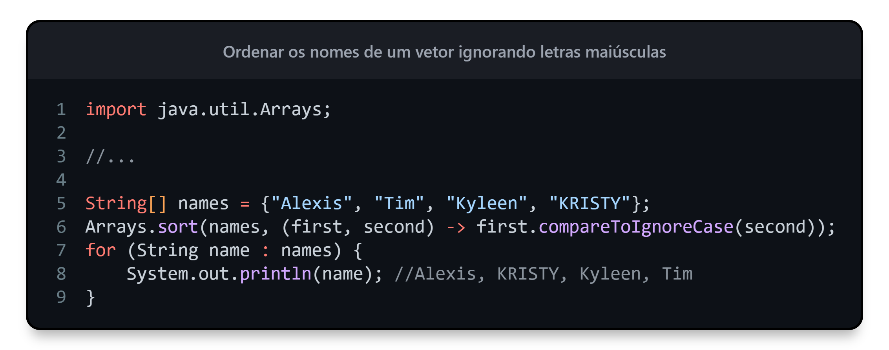</td>
    </tr>
</table>

<table align="center">
    <tr>
        <td>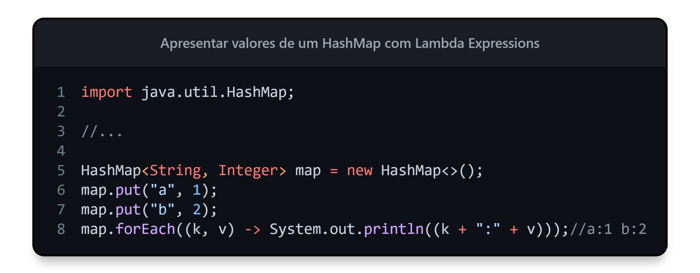</td>
    </tr>
</table>

<table align="center">
    <tr>
        <td>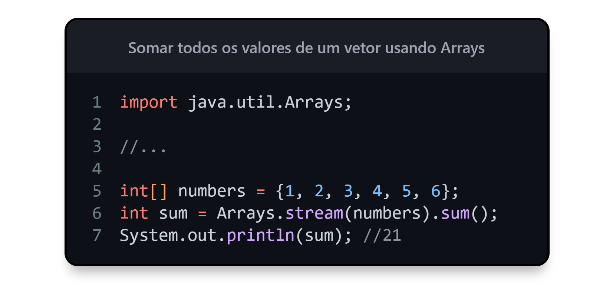</td>
    </tr>
</table>

<table align="center">
    <tr>
        <td>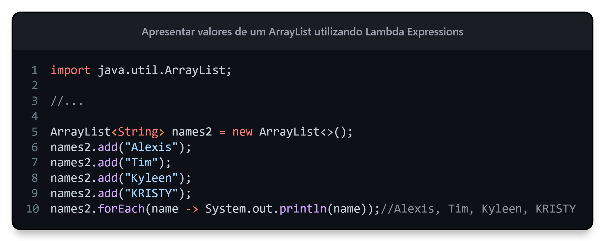</td>
    </tr>
</table>

<table align="center">
    <tr>
        <td>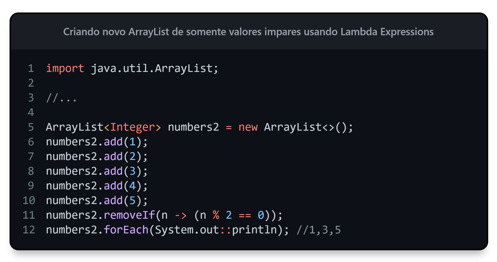</td>
    </tr>
</table>

<table align="center">
    <tr>
        <td>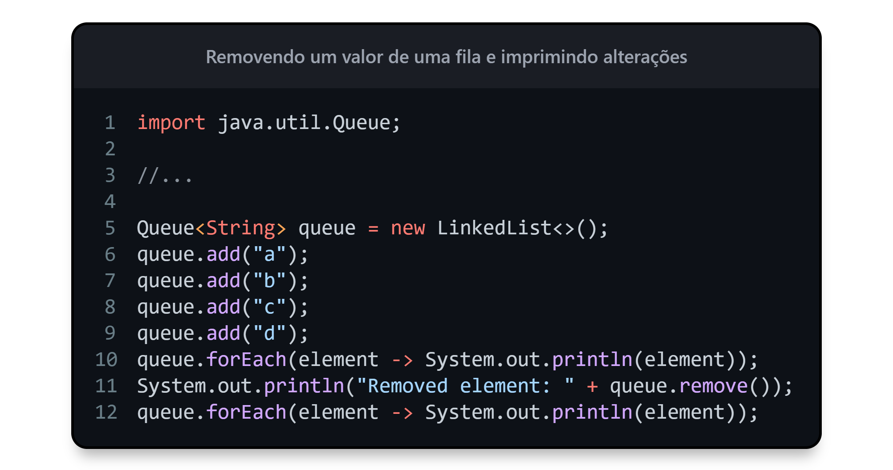</td>
    </tr>
</table>

<table align="center">
    <tr>
        <td>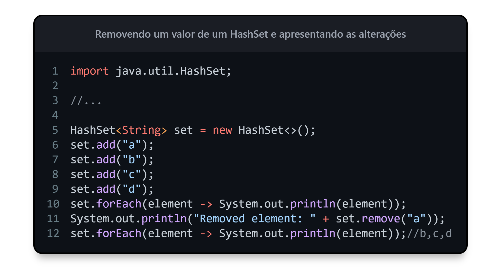</td>
    </tr>
</table>

<table align="center">
    <tr>
        <td>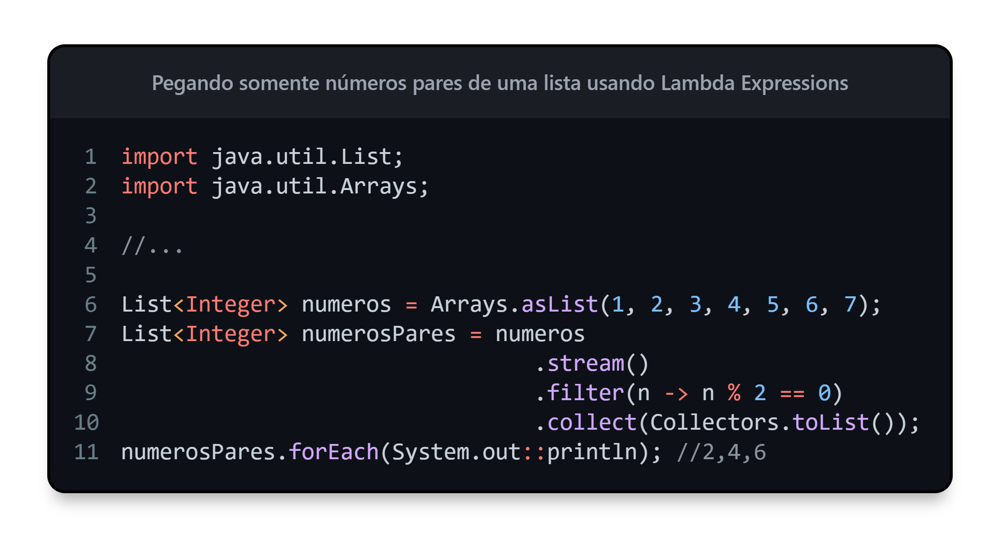</td>
    </tr>
</table>

<table align="center">
    <tr>
        <td>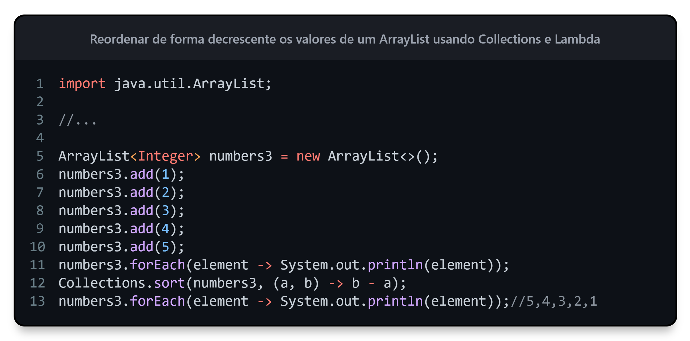</td>
    </tr>
</table>

<table align="center">
    <tr>
        <td>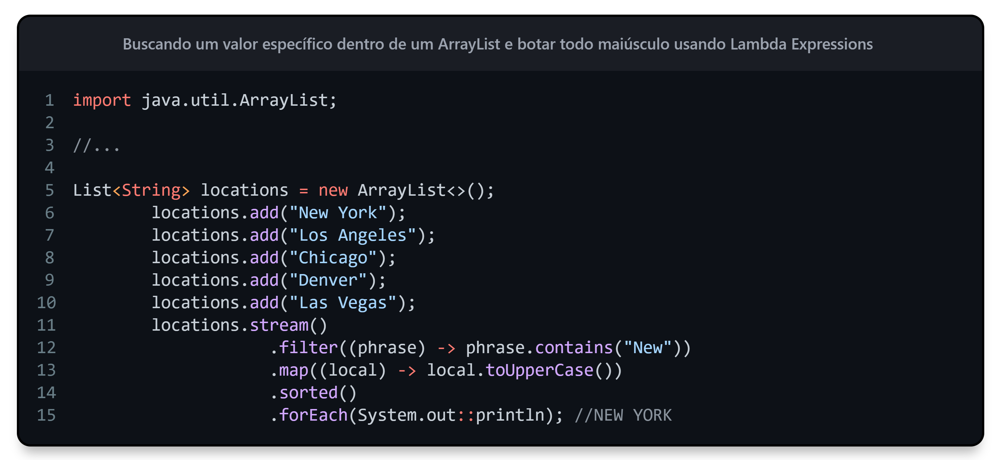</td>
    </tr>
</table>

---

## $$\color{orange} \sf interface$$

Uma interface com lambda em Java refere-se ao uso de uma expressão lambda para implementar uma interface funcional. Uma interface funcional é uma interface que possui apenas um único método abstrato. A introdução das expressões lambda em Java 8 permite que você forneça uma implementação concisa e direta para esse método por meio de uma expressão lambda.

<table align="center">
    <tr>
        <td>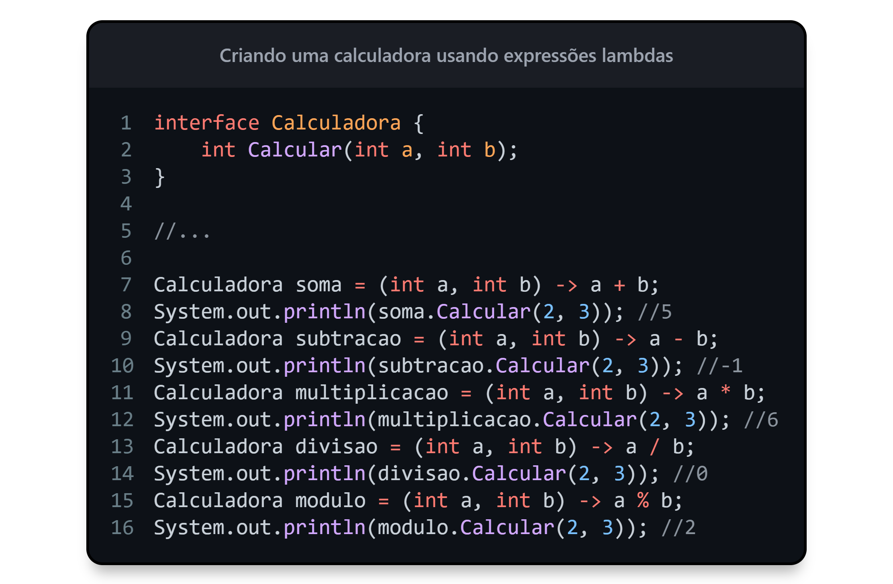</td>
    </tr>
</table>

---

## $$\color{magenta} \sf Classes \space e \space Métodos \space utilizados$$

|Classe|Método|Uso|Descrição
|---|---|---|---|
|Arrays|sort()|permite ordenar os elementos de um array em ordem crescente.
|String|compareToIgnoreCase()|permite comparar duas strings para determinar sua ordem lexicográfica, ignorando diferenças de maiúsculas e minúsculas.
|Hashmap|put(key, value)|adiciona o valor e a chave dentro de um Hashmap.
|Hashmap|foreach()|percorre e imprimir os elementos do mapa.
|ArrayList|foreach()|percorre e imprimir os elementos do mapa.
|ArrayList|foreach()|percorre e imprimir os elementos do mapa.
|Queue|foreach()|percorre e imprimir os elementos do mapa.
|ArrayList|removeIf()|permite remover elementos de uma coleção com base em uma condição especificada. Nesse caso, a condição é definida por meio de uma expressão lambda.
|Arrays|stream()|usado para criar um fluxo (stream) a partir do array numbers. Um fluxo é uma sequência de elementos que permite realizar operações em coleções de dados de forma mais concisa e funcional.
|Arrays|sum()|chamado para realizar a operação de soma de todos os elementos do fluxo
|List|stream()|usado para criar um fluxo (stream) a partir do array numbers. Um fluxo é uma sequência de elementos que permite realizar operações em coleções de dados de forma mais concisa e funcional.
|List|filter()|o método filter() é aplicado ao fluxo para filtrar apenas os elementos que atendem a uma determinada condição. Nesse caso, a condição é definida por meio da expressão lambda (n -> n % 2 == 0), que verifica se o número n é divisível por 2, ou seja, se é um número par.
|List|collect(Collectors.toList())|é utilizado para coletar os elementos filtrados e retornar uma nova lista contendo esses elementos.
|List|map()|usado para transformar cada string restante em letras maiúsculas, aplicando a função toUpperCase() a cada elemento do fluxo.
|List|sorted()|utilizado para ordenar as strings em ordem alfabética ou lexicográfica.
